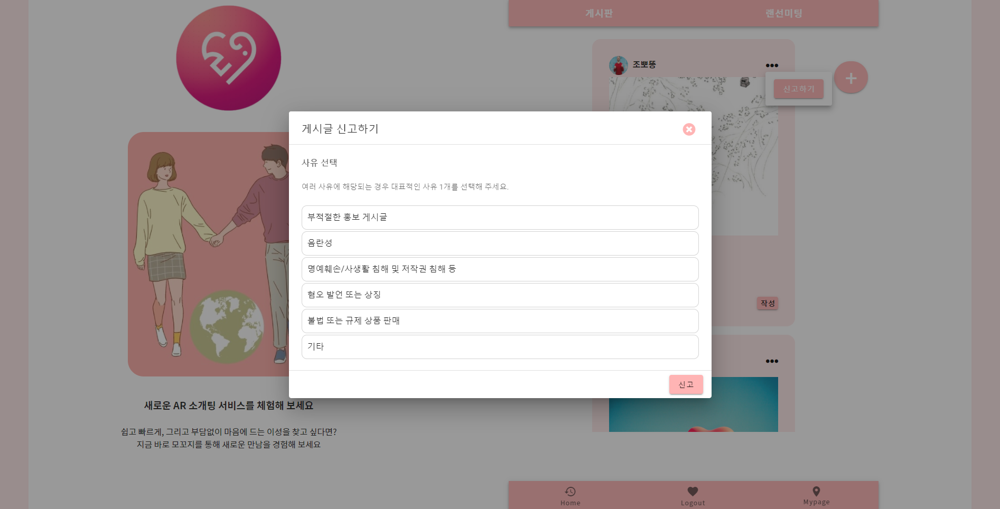
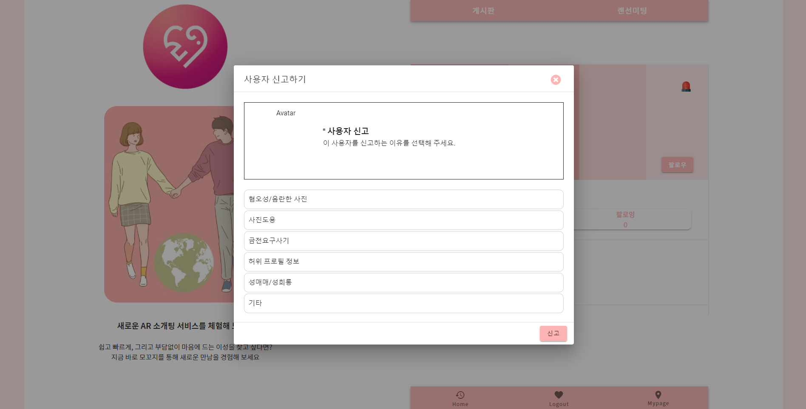

# 포팅 매뉴얼

## 1. CI/CD를 위한 공통 사항

- `jenkins 관리` > `시스템 설정` > `Publish over SSH 설정` 에 들어가서 AWS 접근에 필요한 key파일을 지정
1. Key 파일 지정
- 제공받은 pem파일의 내용을 넣어주면 된다.


1. ssh server 설정
- 제공받은 hostname과 username을 적어주면 된다.
- 여기서는 Hostname : j5b303.p.ssafy.io, Username : ubuntu으로 설정


### Gitlab 플러그인 설치 및 설정

- `jenkins 관리` > `플러그인 관리` > `설치가능` 에서 GitLab 설치
- `jenkins 관리` > `시스템 설정` > `Gitlab 설정` 에서 접근하려고 하는 Gitlab을 지정


- `Credentials` 가 없다면 Add를 눌러 새롭게 추가하면 된다. 여기서는 GitLab API token을 이용해서 등록했다.

> Gitlab API는 gitlab 프로젝트에서 `Settings` > `Access Tokens` 에 들어가면 받을 수 있다.
나의 경우 : R2KiicAnBb7Zz3QJmXmG


- 그리고 해당 API token을 등록해주면 된다


- Test Connection 버튼을 눌러서 gitlab과 연동이 되었는지 확인할 수 있다
- Success가 뜨면 성공

### 소스 코드 관리 설정하기

- Pull할 repository를 등록한다. git branch 전략에 따라 배포하고 싶은 branch로 설정한다.
    - Branch Specifier로 설정 가능


> Credential은 Username with password로 Username은 gitlab의 아이디, password는 비밀번호를 입력해주면 된다.


### 빌드 유발 설정하기

- webhook 시그널을 받고 빌드할 수 있도록 트리거 설정을 해준다.
- [x]  Build when a change is pushed to GitLab webhook URL: .... 을 체크


### Gitlab 시크릿 토큰값 설정하기

- Gitlab webhook 설정에 필요한 시크릿 토큰값을 생성한다.


## Webhook 지정하기

- Gitlab에 지정한 트리거가 발생하면 jenkins로 시그널을 보내줘야 한다. 자동으로 이벤트를 감지하고 시그널을 보낼 수 있도록 다음과 같이 gitlab webhook을 지정해준다.
- Gitlab 프로젝트에서  `Settings` > `Webhooks`
- URL과 secret token을 입력
    - Jenkins에 webhook 시그널이 갈 수 있도록 URL을 입력해준다. 빌드 유발에서 체크할 때 명시되는 URL을 적어주면 된다.
    - 그리고 인증을 위해 빌드 유발 고급 옵션에서 생성한 시크릿 토큰을 입력해 준다.


## 빌드 플러그인 설정

### 빌드를 위한 플러그인 설정

- NodeJS 빌드를 위한 NodeJS 플러그인을 설치

### 빌드 플러그인 설정하기

- `jenkins 관리` > `Global Tool Configuration` 에서 nodejs와 gradle 버전을 설치


### 빌드 환경 설정하기

- `jenkins` > `[Item_name]` > `구성` 에서 빌드환경을 추가
- 아까 설치한 NodeJS 플러그인을 등록


### Pull 테스트

- `jenkins` > `[Item_name]` 에서 Build Now 를 클릭하여 빌드가 되는지 확인
- 정상적으로 실행되고 나면 git repository에 있는 master branch를 땡겨온 것을 확인할 수 있다.
- Docker volume 설정한 /app/swim/workspace에 git repository 땡겨오기

```bash
ubuntu@ip-172-26-0-195:/app/swim/workspace/b303$ ls
README.md  SUB1  backend  frontend
```

## 2. 프론트엔드(Vue.js 2.0)

- Jenkins에서 merge, push event가 발생했을 때, `Execute shell` 을 통해 아래의 command를 수행한다.

```bash
cd frontend
npm install -g yarn
yarn install
yarn build
```

- AWS EC2에 Nginx (nginx/1.18.0 (Ubuntu)) 를 설치하고 `/etc/nginx/sites-enabled` 폴더의 default 파일에서 환경설정을 한다.

```bash
server {
	listen 80 default_server;
	listen [::]:80 default_server;

	root /home/ubuntu/deploy/dist;	# Front build file location

	index index.html index.htm;	# index filename

	server_name _;	# server domain

	location / {
		try_files $uri $uri/ /index.html;
	}
	
	location /api {
		proxy_pass http://3.35.195.232:8000/api/;
		proxy_redirect off;
		charset utf-8;

		proxy_set_header X-Real-IP $remote_addr;
		proxy_set_header X-Forwarded-For $proxy_add_x_forwarded_for;
		proxy_set_header X-Forwarded-Proto $scheme;
		proxy_set_header X-Nginx-Proxy true;
	}
}
```

- 빌드 후 조치는 `Send build artifacts over SSH` 를 통해 /home/ubuntu/deploy/dist 경로로 vue build 파일인 dist directory를 통째로 옮기도록 지정합니다.

## 3. 백엔드

자바 버전, IDE 버전

```bash
IntelliJ IDEA 2021.1.3 x64
sts-3.9.14.RELEASE

openjdk version "12" 2019-03-19
OpenJDK Runtime Environment (build 12+32)
OpenJDK 64-Bit Server VM (build 12+32, mixed mode, sharing)
```

배포 스크립트(deploy.sh)

- Jenkins에서 merge, push event가 발생했을 때, `Send build artifacts over SSH` 를 통해 /home/ubuntu/deploy/server 경로로 jar파일을 이동시킨다.
- 그 후 deploy.sh 파일을 실행한다.
- Jenkins에서 time out이 발생할 경우 수동으로 deploy.sh파일을 실행한다.

```bash
#!/bin/bash

cd /home/ubuntu/deploy/server

chmod +x ./recruit-0.0.1-SNAPSHOT.jar

echo "> 현재 구동 중인 애플리케이션 pid 확인"

CURRENT_PID=$(pgrep -f recruit-0.0.1-SNAPSHOT.jar)

echo "현재 구동 중인 애플리케이션 pid : $CURRENT_PID"

if [ -z "$CURRENT_PID" ]; then
	echo "> 현재 구동 중인 애플리케이션이 없으므로 종료하지 않습니다."
else
	echo "> kill -15 $CURRENT_PID"
	kill -15 $CURRENT_PID
	sleep 5
fi

echo "> 새 애플리케이션 배포"

nohup java -jar /home/ubuntu/deploy/server/recruit-0.0.1-SNAPSHOT.jar &
```

## 4. 데이터베이스 정보 - AWS + Docker + MariaDB

AWS EC2 root 계정

PW: ssafyb303

MariaDB 계정

ID: root

PW: ssafyb303

public ip address: 172.26.0.195

- application.properties

```bash
spring.datasource.driver-class-name=org.mariadb.jdbc.Driver
spring.datasource.url=jdbc:mariadb://{public-ip}:3306/B303
spring.datasource.username=root
spring.datasource.password=비밀번호
```


## 5. 프로젝트에서 사용하는 외부 서비스 정보 문서

# Openvidu deployment

참고 : [openvidu - deployment - On premises](https://docs.openvidu.io/en/2.19.0/deployment/ce/on-premises/)

## Openvidu 서버 배포

> openvidu on promises 방식으로 배포
>
> 이 방식은 low-level에 속하는 서버 설정(openvidu server, kurento media server, coturn, redis, nginx 등의 서버를 도커 컨테이너만 가져와서 별도로 추가 설정 없이 사용할 수 있게 하는 것)
>
> docker-compose를 이용해 위 서버들이 실행되는 도커 컨테이너들을 통합 관리
>
> 기본적으로 아래 설정들은 ubuntu 환경에서 실행됨

- 적용하면서 특이했던 사항
  기존의 kurento coturn과 충돌이 발생해 애를 많이 먹었다.

- Docker 설치

  ```bash
  $ sudo apt-get update
  $ sudo apt-get install \
      apt-transport-https \
      ca-certificates \
      curl \
      gnupg \
      lsb-release
  $ curl -fsSL https://download.docker.com/linux/ubuntu/gpg | sudo gpg --dearmor -o /usr/share/keyrings/docker-archive-keyring.gpg
  $ echo \
    "deb [arch=amd64 signed-by=/usr/share/keyrings/docker-archive-keyring.gpg] https://download.docker.com/linux/ubuntu \
    $(lsb_release -cs) stable" | sudo tee /etc/apt/sources.list.d/docker.list > /dev/null
  $ sudo apt-get update
  $ sudo apt-get install docker-ce docker-ce-cli containerd.io
  ```

- Docker-Compose 설치

  ```bash
  $ sudo curl -L "https://github.com/docker/compose/releases/download/1.29.2/docker-compose-$(uname -s)-$(uname -m)" -o /usr/local/bin/docker-compose
  $ sudo chmod +x /usr/local/bin/docker-compose
  ```

- 보안그룹 인바운드 설정

  - **22 TCP**: to connect using SSH to admin OpenVidu.
  - **80 TCP**: if you select Let's Encrypt to generate an SSL certificate this port is used by the generation process.
  - **443 TCP**: OpenVidu server and application are published by default in standard https port.
  - **3478 TCP+UDP**: used by TURN server to resolve clients IPs.
  - **40000 - 57000 TCP+UDP**: used by Kurento Media Server to establish media connections.
  - **57001 - 65535 TCP+UDP**: used by TURN server to establish relayed media connections.

- Deployment

  - root 권한 설정

    ```bash
    $ sudo su
    ```

  - /opt 폴더에 설치를 권장

    ```bash
    $ cd /opt
    ```

  - openvidu 설치

    ```bash
    $ curl https://s3-eu-west-1.amazonaws.com/aws.openvidu.io/install_openvidu_latest.sh | bash
    ```

  - configuration

    - /opt/openvidu/.env 파일 수정(letsencrypt로 수정 시)

      - DOMAIN_OR_PUBLIC_IP : 오픈바이두 서버가 사용 가능한 도메인명 또는 public ip
      - CERTIFICATE_TYPE: 증명서 타입
      - OPENVIDU_SECRET: dashboard 입장 시 로그인 패스워드(default username: OPENVIDUAPP)
      - LETSENCRYPT_EMAIL : certificate type이 letsencrypt라면 해당 증명서 발급시 입력한 이메일(아니여도 상관이 없는 것 같지만 유효한 이메일을 적어야 함)

      ```json
      DOMAIN_OR_PUBLIC_IP=i5a306.p.ssafy.io
      
      CERTIFICATE_TYPE=letsencrypt
      
      OPENVIDU_SECRET=GOM_SECRET
      
      LETSENCRYPT_EMAIL=<<유효한 이메일>>
      ```

  - start

    - /opt/openvidu/ 에서 실행

    ```bash
    $ ./openvidu start
    ```


## 🟡 주요 기능 사진

1. **일대일 화상회의**

- 카메라 ON / OFF, 마이크 ON / OFF, 실시간 채팅 기능을 제공합니다. 
- 화상회의 화면 클릭을 통해 상대방과 나의 화면을 전환할 수 있습니다.
- 나가기 버튼을 통해 화상회의를 종료할 수 있습니다.
- 채팅을 통해 상대방과 메세지를 주고받을 수 있으며, 채팅 메세지에서는 상대방의 프로필 이미지를 확인할 수 있습니다.
- 내가 아직 읽지 않은 상대방의 메세지가 존재할 시, 파란색 동그라미 내 숫자를 통해 알 수 있습니다.


2. **로그인**

- 아이디와 비밀번호를 입력하여 사용자 인증을 받고 로그인할 수 있습니다. 
- 아이디와 비밀번호 중 가입 시 입력한 내용과 일치하지 않는 값이 존재할 경우 하단에 경고창이 출력됩니다.
- 이메일은 반드시 '@'을 포함한 이메일 형식을 지켜야 합니다.


3. **회원가입**

- 이메일은 입력과 동시에 서버 통신을 통해 중복검사를 수행하며 하단에 중복 여부를 확인할 수 있습니다.
- 닉네임 역시 이메일과 마찬가지로 중복 여부를 입력 즉시 수행합니다.
- 비밀번호는 10 ~ 15자 사이의 값을 입력합니다.
- 생년월일은 GUI 캘린더를 통해 쉽게 입력할 수 있습니다. 
- '남', '여' 중 하나의 성별을 SELECT 옵션을 통해 선택할 수 있습니다.
- 주소 검색 API를 활용하여 지번주소와 도로명 주소를 통해 쉽고 빠르게 주소를 입력할 수 있습니다.
- 대표 프로필 이미지, 프로필 이미지를 첨부할 수 있으며 이미지의 경우 첨부하면 하단의 미리보기 화면을 통해 이미지를 확인할 수 있습니다.
- 대표 프로필의 경우 용량은 2MB를 넘지 않아야 합니다. 
- 프로필 이미지의 경우 최대 7장까지 선택할 수 있으며, 역시 개별 용량은 2MB를 넘지 않아야 합니다.


4. **커뮤니티 게시판**

- 사용자들이 작성한 게시글을 확인할 수 있습니다. 
- 우측 상단의 ... 버튼을 통해 내가 작성한 게시글인 경우 수정하기 버튼이 활성화되며, 신고하기 버튼을 통해 게시글을 신고할 수 있습니다.
- 게시글 상단의 프로필 이미지를 클릭하여 상대방의 프로필 페이지로 이동할 수 있습니다.
- 하트 버튼을 눌러 게시글에 좋아요 기능을 선택할 수 있습니다.
- 페이지 내 이미지는 1장에서 5장까지 출력되며, 1장인 경우 v-card를 통해, 2장 이상인 경우 carousel을 통해 출력됩니다.
- 댓글 더보기를 클릭하여 게시글에 작성된 모든 댓글을 확인할 수 있습니다.
- 댓글 달기에 내용을 입력하고, 작성 버튼을 눌러 해당 게시글에 댓글을 작성할 수 있습니다.
- 게시글 내용을 눌러 상세 페이지로 이동할 수 있습니다.
- 우측 상단의 '+' 버튼을 눌러 새로운 게시글을 작성할 수 있습니다.


5. **게시글 신고**

- 이용자는 하나의 게시글을 몇 가지 종류의 사유로 신고할 수 있습니다.



6.  프로필 화면 & 유저 신고

- 사용자는 프로필 페이지를 통해 상대방의 인적사항을 확인할 수 있습니다.
- 이름과 이메일을 확인할 수 있으며, 상대방의 대표 프로필 이미지를 확인할 수 있습니다. 
- 팔로우 버튼을 통해 상대방을 팔로우할 수 있습니다. 
- 우측 상단의 사이렌 버튼을 눌러, 이용자를 신고할 수 있습니다. 
- 상대방의 팔로워, 팔로잉 수를 확인할 수 있습니다.
- 상대방이 가입할 때 입력한 관심사를 확인할 수 있습니다. 
- 하단의 게시물 탭을 통해 상대방이 등록한 이미지를 확인할 수 있습니다.




7. 메인 페이지

