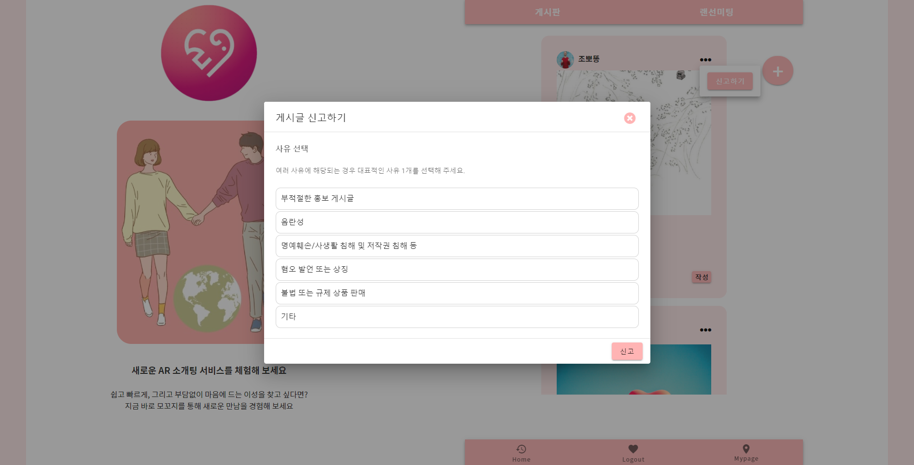
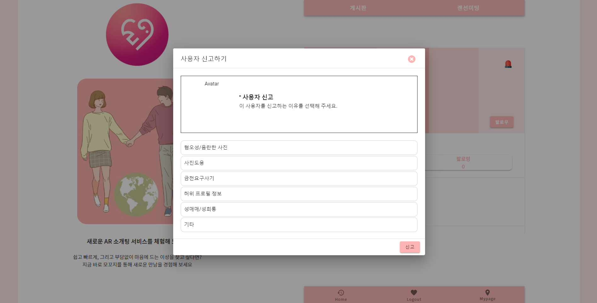

# AR 소개팅 서비스 : Mokkozi

> Mokkozi는 '모임'을 뜻하는 순우리말로, 20대 남녀를 주요 타게팅으로 한 소개팅 서비스입니다.


## 🟠 주요기능

- Openvidu를 활용한 1:1 화상회의
- 20대 남녀 간 소통을 위한 커뮤니티 게시판 제공, Follow & Following 통한 회원 간 소통
- 관리자의 회원 관리 기능
- 랜덤 매칭 기능


## 🟢 세부 기능

| 구분 | 기능                                 | 설명                                                         |
| ---- | ------------------------------------ | ------------------------------------------------------------ |
| 1    | 화상 회의                            | WebRTC 기능을 사용하여 양질의 양방향 소통이 가능한 화상미팅, 채팅 기능 제공 |
| 2    | 커뮤니티 게시판 및 회원 간 소통 기능 | S3를 이용, 이미지 업로드를 통해 회원간 일상을 공유할 수 있으며 Follow & Following 을 통해 회원 간 직접적인 소통이 가능 |
| 3    | 관리자 회원 관리 기능                | 회원 상태 변경, 유저 & 게시글 신고 처리                      |
| 4    | 사용자 간 랜덤 추천 기능             | 사용자의 거주지를 기준으로 또는 임의의 기준으로 다른 사용자를 추천하는 기능 |


## 🔵 Architecture


## 🟡 주요 기능 사진

1. **일대일 화상회의**

: 카메라 ON / OFF, 마이크 ON / OFF, 실시간 채팅 기능 제공


2. **로그인**


3. **회원가입**


4. **커뮤니티 게시판**


5. **게시글 신고**



6.  프로필 화면 & 유저 신고




7. 메인 페이지


## 🟣 개발 설정

### OpenVidu 설치 

> openvidu on promises 방식으로 배포
>
> 이 방식은 low-level에 속하는 서버 설정(openvidu server, kurento media server, coturn, redis, nginx 등의 서버를 도커 컨테이너만 가져와서 별도로 추가 설정 없이 사용할 수 있게 하는 것)
>
> docker-compose를 이용해 위 서버들이 실행되는 도커 컨테이너들을 통합 관리
>
> 기본적으로 아래 설정들은 ubuntu 환경에서 실행됨

- 적용하면서 특이했던 사항
  기존의 kurento coturn과 충돌이 발생해 애를 많이 먹었다.

- Docker 설치

  ```bash
  $ sudo apt-get update
  $ sudo apt-get install \
      apt-transport-https \
      ca-certificates \
      curl \
      gnupg \
      lsb-release
  $ curl -fsSL https://download.docker.com/linux/ubuntu/gpg | sudo gpg --dearmor -o /usr/share/keyrings/docker-archive-keyring.gpg
  $ echo \
    "deb [arch=amd64 signed-by=/usr/share/keyrings/docker-archive-keyring.gpg] https://download.docker.com/linux/ubuntu \
    $(lsb_release -cs) stable" | sudo tee /etc/apt/sources.list.d/docker.list > /dev/null
  $ sudo apt-get update
  $ sudo apt-get install docker-ce docker-ce-cli containerd.io
  ```

- Docker-Compose 설치

  ```bash
  $ sudo curl -L "https://github.com/docker/compose/releases/download/1.29.2/docker-compose-$(uname -s)-$(uname -m)" -o /usr/local/bin/docker-compose
  $ sudo chmod +x /usr/local/bin/docker-compose
  ```

- 보안그룹 인바운드 설정

  - **22 TCP**: to connect using SSH to admin OpenVidu.
  - **80 TCP**: if you select Let's Encrypt to generate an SSL certificate this port is used by the generation process.
  - **443 TCP**: OpenVidu server and application are published by default in standard https port.
  - **3478 TCP+UDP**: used by TURN server to resolve clients IPs.
  - **40000 - 57000 TCP+UDP**: used by Kurento Media Server to establish media connections.
  - **57001 - 65535 TCP+UDP**: used by TURN server to establish relayed media connections.

- Deployment

  - root 권한 설정

    ```bash
    $ sudo su
    ```

  - /opt 폴더에 설치를 권장

    ```bash
    $ cd /opt
    ```

  - openvidu 설치

    ```bash
    $ curl https://s3-eu-west-1.amazonaws.com/aws.openvidu.io/install_openvidu_latest.sh | bash
    ```

  - configuration

    - /opt/openvidu/.env 파일 수정(letsencrypt로 수정 시)

      - DOMAIN_OR_PUBLIC_IP : 오픈바이두 서버가 사용 가능한 도메인명 또는 public ip
      - CERTIFICATE_TYPE: 증명서 타입
      - OPENVIDU_SECRET: dashboard 입장 시 로그인 패스워드(default username: OPENVIDUAPP)
      - LETSENCRYPT_EMAIL : certificate type이 letsencrypt라면 해당 증명서 발급시 입력한 이메일(아니여도 상관이 없는 것 같지만 유효한 이메일을 적어야 함)

      ```json
      DOMAIN_OR_PUBLIC_IP=i5a306.p.ssafy.io
      
      CERTIFICATE_TYPE=letsencrypt
      
      OPENVIDU_SECRET=GOM_SECRET
      
      LETSENCRYPT_EMAIL=<<유효한 이메일>>
      ```

  - start

    - /opt/openvidu/ 에서 실행

    ```bash
    $ ./openvidu start
    ```

